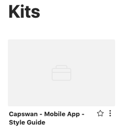

# Lingo Asset Fetcher - Library

> Automate fetching assets from your lingo workspace to your local project


---

## Installation

```
npm install laf-lib -S
```

## Usage

#### Core Experience

**lingo-asset-fetcher-lib** is a core dependency of [LAF](https://www.npmjs.com/package/laf). LAF is a CLI which abstracts all of this functionality into a single, easy-to-use command which can run from your terminal or package.json.

If you're looking for an out-of-the-box solution, check LAF out here:

- `@github`: [lingo-asset-fetcher-cli](https://github.com/servexyz/lingo-asset-fetcher-cli)
- `@npm`: [laf](https://www.npmjs.com/package/laf)

---

#### Programmatic Usage

**What you'll learn below**

1. How to create a configuration object
2. What's the minimum you need to know about calling init
3. How to utilize it

---

###### 1. Create a configuration object, like so:

```json
{
  "sections": [
    {
      "name": "Illustrations"
    },
    {
      "name": "Icons",
      "headers": ["Icons", "Components"]
    }
  ]
}
```

These configurations are specific to my project, which currently looks like:


###### 2. Get ready to use that config object in an init function

But first, let's understand the init function. Here's the minimum you need to know to get started:

```js
init(
  "name of kit",
  myConfigObject,
  "./root/output/directory/to/download/files/into",
  "fileFormat"
);
```

> Curious about which fileFormats options are available? Read more here:
>
> [http://developer.lingoapp.com/lingojs/#available-file-cuts](http://developer.lingoapp.com/lingojs/#available-file-cuts)

###### 3. This is how that might look for my project:

> Important _Case Sensitive_ note:
>
> - Kit name is case sensitive.
> - Config object is case sensitive.
> - The file format is _not_ case sensitive (ie. png or PNG both work)

```js
let myConfigObject = {
  sections: [
    {
      name: "Illustrations"
    },
    {
      name: "Icons",
      headers: ["Icons", "Components"]
    }
  ]
};

init(
  "Capswan - Mobile App - Style Guide",
  myConfigObject,
  "./downloads/capswan/app/style_guide",
  "PNG"
);
```

**Additional Notes**

- The directories don't need to exist before calling them.
- The kit name is real (spaces and all):
  

---

---

## init()

> Added in case you're too lazy to open `src/lingo.js`

```js
/**
 *
 * @param {string} kitName
 * @param {object} extractTarget
 * @param {string} outputDirectory
 * @param {string} outputFormat
 * @param {string} spaceId
 * @param {string} apiToken
 * @param {int} kitVersion
 */
export async function init(
	kitName = "Test Me",
	extractTarget = null,
	outputDirectory = "./downloads",
	outputFormat = "PNG",
	spaceId = null,
	apiToken = null,
	kitVersion = 0
)
```
